# ThingsBoard Integration

This repository provides an integration between [Ingics BLE Beacon Gateway](https://www.ingics.com/ble_wifi_gw.html) (iGS03) and [ThingsBoard](https://thingsboard.io/docs/), an open-source IoT platform for data collection, processing, and visualization.

## Table of Contents
- [ThingsBoard Integration](#thingsboard-integration)
  - [Table of Contents](#table-of-contents)
  - [Overview](#overview)
  - [Requirements](#requirements)
  - [Quick Start](#quick-start)
    - [Installation](#installation)
    - [Import Rule Chains](#import-rule-chains)
      - [Rule Chain for iGS03 Message Handler](#rule-chain-for-igs03-message-handler)
      - [Rule Chains for Fix Message Timestamp](#rule-chains-for-fix-message-timestamp)
      - [Rule Chains for Customize Payload Parser](#rule-chains-for-customize-payload-parser)
    - [Create Device Profiles](#create-device-profiles)
    - [Create Device Entities](#create-device-entities)
      - [Create iGS03 Device Entity](#create-igs03-device-entity)
      - [Create Sensor Beacon Entity](#create-sensor-beacon-entity)
    - [Configure iGS03 Application](#configure-igs03-application)
    - [Enjoy It](#enjoy-it)
  - [Add Customize Parser for Other Sensor Tag](#add-customize-parser-for-other-sensor-tag)
    - [Customize Parser Rule](#customize-parser-rule)
    - [MyNewTag Parser Script](#mynewtag-parser-script)
    - [Create Device Profile](#create-device-profile)
    - [Create Device Entity](#create-device-entity)
    - [Simulate iGS03 Publish Data](#simulate-igs03-publish-data)
  - [Revision History](#revision-history)

## Overview

Ingics Beacon Gateway (iGS03) provides a scalable, reliable and secure gateway for IoT deployments that require receiving BLE advertisements from BLE sensor tags (beacons). This integration enables the gateway to communicate with the ThingsBoard platform, allowing for the visualization and management of the data collected from the beacons.

The integration is achieved through a set of ThingsBoard Rule Chains that parse the retrieved data from the gateway and forward it to the specified device entity. This guide use Ingics iBS03T and iBS01H as example, and users can add/customize the parser rule chain for non-INGICS BLE tags.

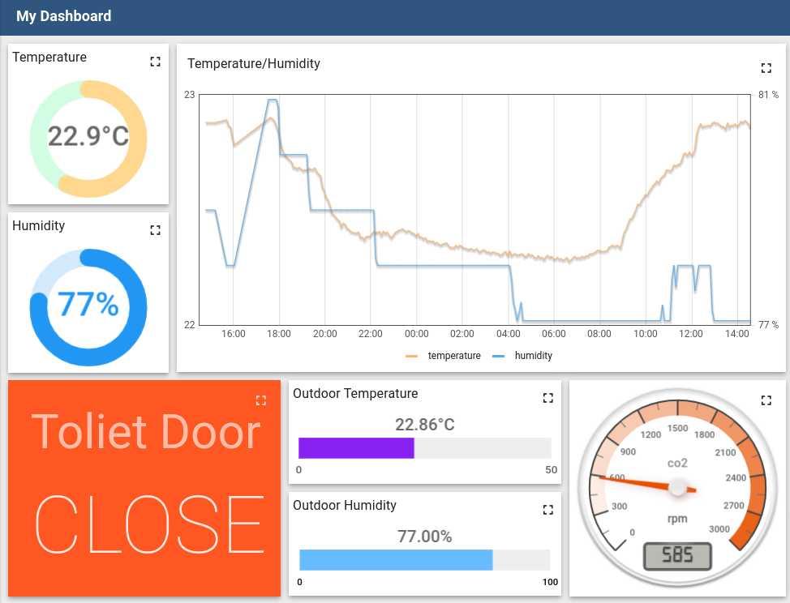

## Requirements

- ThingsBoard (3.4.4 tested in this guide)
- Ingics Beacon Gateway iGS03 x 1
- BLE sensor beacons using BLE advertisement to broadcast sensor data (Ingics [iBS03T](https://www.ingics.com/prod-ibs03t.html) and iBS01H in this guide)

## Quick Start

### Installation

Please follow the [ThingsBoard Installation Guid](https://thingsboard.io/docs/user-guide/install/installation-options/) to setup a ThingsBoard system. In this guide, we use [Docker+Ubuntu](https://thingsboard.io/docs/user-guide/install/docker/) and [thingsboard/tb-postgres](https://hub.docker.com/r/thingsboard/tb-postgres) as docker image with In-Memory queue service.

### Import Rule Chains

First, we need to install some rule chains for handling the iGS03 publish message. The files located in [rules](https://github.com/ingics/thingsboard-integration/tree/decoded_format/rules) folder.

#### Rule Chain for iGS03 Message Handler

[ingics_igs03_message_rule.json](https://github.com/ingics/thingsboard-integration/tree/decoded_format/rules/ingics_igs03_message_rule.json)

This is the root rule chain for handling iGS03 device message. All messages publish to the device entity will be handled by this rule chain. The rule chain did
1. Split messages (iGS03 message may contain multiple data in one publish)
2. Change the originator to the beacon device by tag name (MAC address)
3. Check if customize parser is required
4. Clean up the message for saving telemetry on the device entity

#### Rule Chains for Fix Message Timestamp

[ingics_igs03_timestamp_correction.json](https://github.com/ingics/thingsboard-integration/tree/decoded_format/rules/ingics_igs03_timestamp_correction.json)

The iGS03 support publish data with BLE receiving timestamp. This rule chain is used for filling the ADV timestamp into ThingsBoard message. It will be called by root rule chain of iGS03 message handler.

#### Rule Chains for Customize Payload Parser

[customize_parser_rule.json](https://github.com/ingics/thingsboard-integration/tree/decoded_format/rules/customize_parser_rule.json)

Rule chain for customize parsers, including an example script. ThingsBoard support to development the parser script in Java Script. User can add their own payload parser into this rule chain.

### Create Device Profiles

Then, create a device profile for iGS03 device. The device profile are used to connect the device entities (we will create them in [next section](#create-device-entities)) and rule chains.

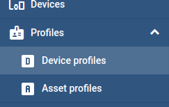

Just make sure to select the Rule chain as "Ingics iGS03 Message Rule".

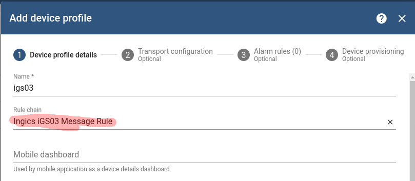

### Create Device Entities

We use below devices in this guide.
| Model | MAC | Note |
| ----- | --- | ---- |
| iGS03W | F008D178943C | gateway for publish message |
| iBS03T | 806FB087F49B | provide temperature & humidity |
| iBS01H | F973D9D36662 | provide hall sensor for door close state |

#### Create iGS03 Device Entity

Let's create a new device entity for iGS03.

The main configuration is setup the device profile to [igs03](#device-profile-for-gateway-igs03). That also means we setup the root rule chain of this device to [Ingics iGS03 Message Rule](#rule-chain-for-igs03-message-handler), all messages published to this device will be handle by the rule.

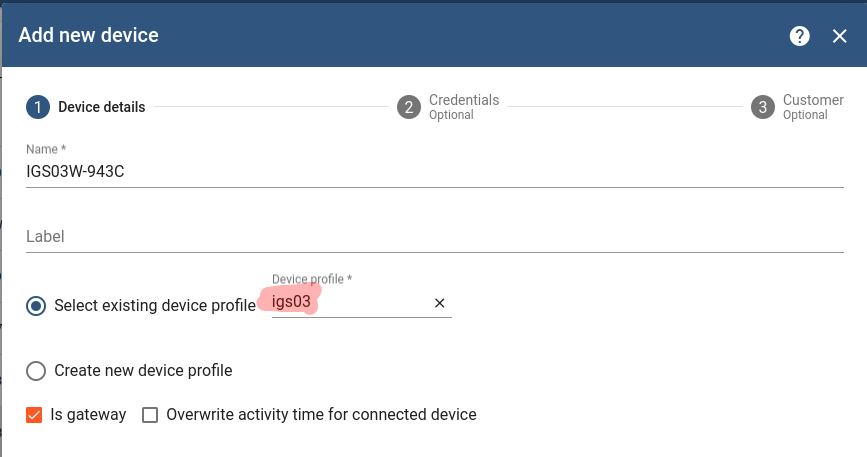

Then, we need to setup the credentials for MQTT authentication. Whatever "Access Token", "X.509" or "MQTT Basic" can be used by iGS03. In this guide, we use "Access Token" here for simplify the setting. We will use the token to setup iGS03 application [later](#configure-igs03-application).

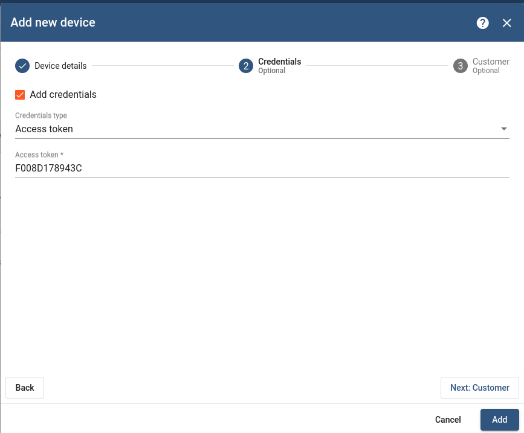

#### Create Sensor Beacon Entity

Let's create the device entity for the iBS03T beacon.

The device name must be the BLE MAC of the beacon. We need the device name to deliver the message to this device entity in [Ingics iGS03 Message Rule](#rule-chain-for-igs03-message-handler). The device name must match the 'tag' field in iGS03 message payload.

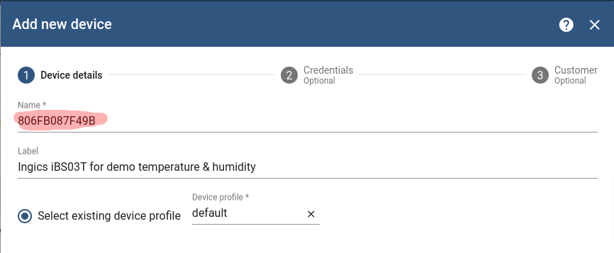

We don't care about the credentials for beacon device, just click "Add" to create the device entity. And them, create another device for iBS01H in the same way.

### Configure iGS03 Application

Now we can setup the iGS03 to publish data to the MQTT broker of ThingsBoard. Connect to the iGS03 WebUI and setup the "Application" as blow.

1. Target Host/IP

   The IP address of ThingsBoard

2. Publish Topic

   > v1/device/me/telemetry

   Defined by [ThingsBoard MQTT API]([https://](https://thingsboard.io/docs/reference/mqtt-api/#telemetry-upload-api)).

3. Username

   Must be the access token we setup when [create iGS03 device entity](#create-gateway-device-entity) in ThingsBoard. If you choice different credential when create iGS03 device entity, follow your security settings to configure the iGS03 application.

4. Message Format

    > JSON String (decoded)

   Means to enable the iGS03 built-in payload parser for data publish. Most INGICS sensor beacons are supported by this parser. Then user don't need to develop parser scripts for them.

The application settings should be looks like

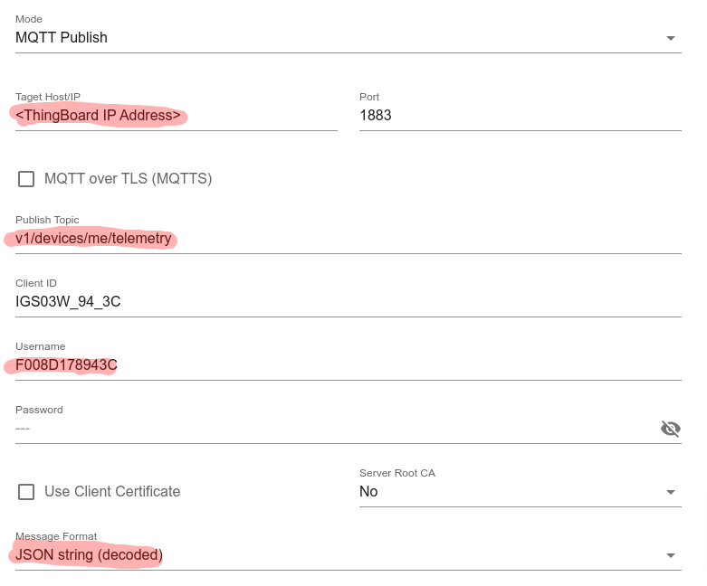

For avoid publish unwanted messages to the ThingsBoard system, suggest to setup the filter on iGS03, too.

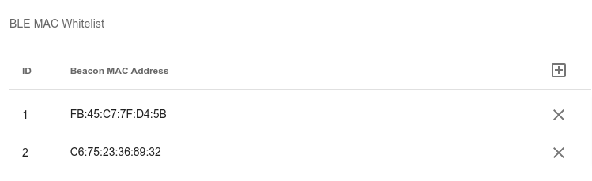

### Enjoy It

Things should be done. The telemetries should be published to the device entities now. Check the detail of the device entity.

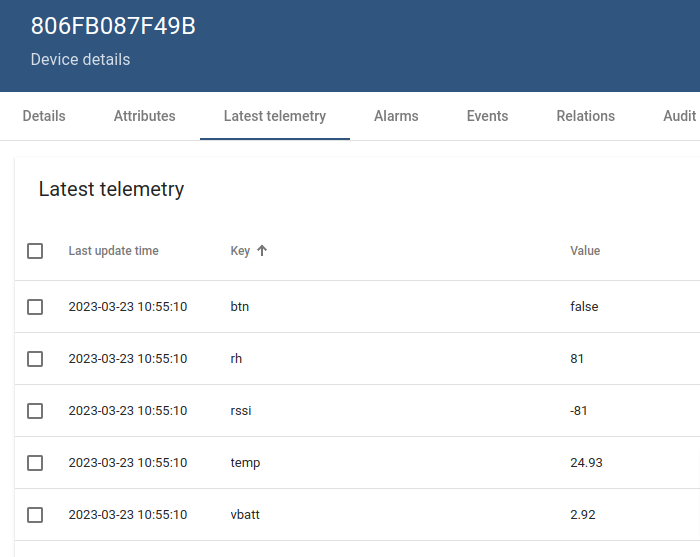

Now you can follow the documentation of ThingsBoard to create dashboards, alarms, ....

## Add Customize Parser for Other Sensor Tag

For user using non-INGICS sensor tags. This chapter provide steps to add customize parser script for it. For demo, we assume the beacon model name is "MyNewTag".

### Customize Parser Rule

We already import a customize parser rule chain in previous step. It is a entry point of "Unknown" message (not support by iGS03 built-in parser) handler.

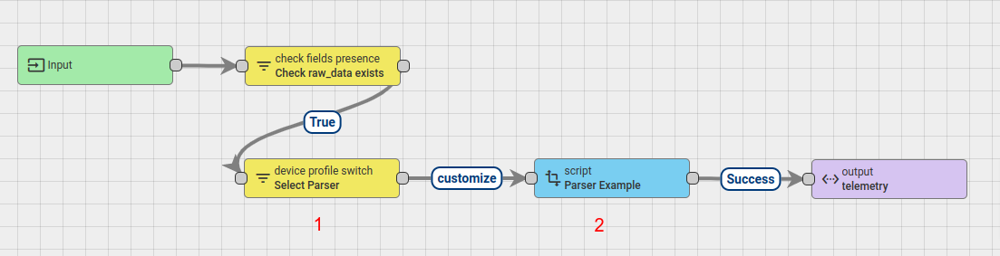

There are two major things in this rule chan.
1. Parser selector: it use the device profile name to choice different parser script.
2. Parser script: the parser code (in Java Script) to parse the payload HEX string to telemetry message.

### MyNewTag Parser Script

Take a look on parser example.

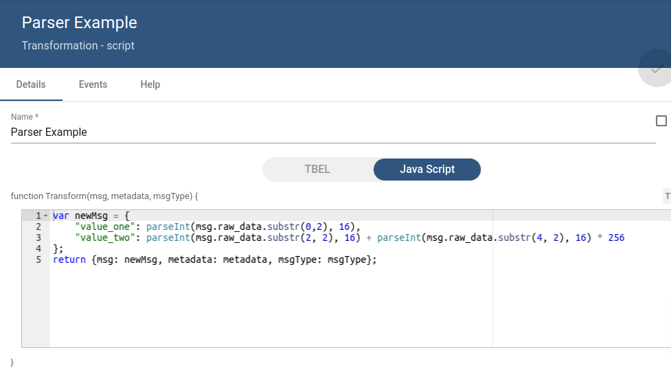

The HEX string of payload will be stored in msg.raw_data (for example: "1EFF0600010920026F9FED438F158F0DE9AFD6CE11DD5AE7470F504D691B66"). The parser script need to get the telemetry values and store into msg field.

The output message will be looks like:

    {
      "value1": 2.92,
      "value2": 26,
    }

So, let's add a new "script" rule node in [Customize Parser Rule](#customize-parser-rule), called "MyNewTag Parser", develop the parser script in it. And add links for it to other rule nodes, looks like:

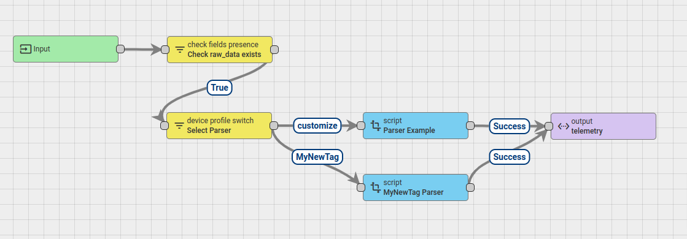

### Create Device Profile

We link the "Parser Selector" and the parser script by device profile named "MyNewTag". So, we need to create a device profile for it. The only configuration we needed is the profile name, you can skip other configurations.

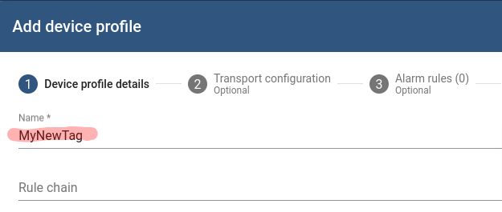

### Create Device Entity

Now, we can add the device entity for the beacon. Follow the same way we did for iBS03T, create the device use BLE mac address as device name, and choice the "MyNewTag" as device profile.

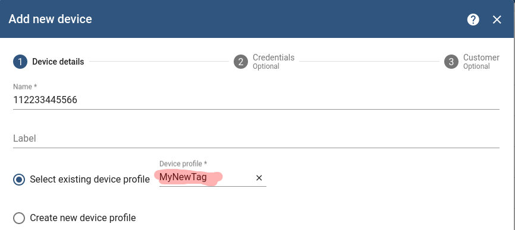

### Simulate iGS03 Publish Data

You may want to simulate the iGS03 to publish data to ThingsBoard for debugging the configuration or parser rule. The iGS03 publish format for "Unknown" tag should be

    {"data":[{"ts":1634020191,"gw":"F008D1798C60","tag":"61EBA16FC2AE","rssi":-50,"type":"Unknown","raw_data":"1EFF0600010920026F9FED438F158F0DE9AFD6CE11DD5AE7470F504D691B66"}]}

So, you can use MQTT client application to publish data to ThingsBoard for debugging. For example:

    # mosquitto_pub -h <ThingsBoard IP> -p 1883 -t v1/devices/me/telemetry  -u <Access Token> -d -m '{"data":[{"ts":1634020191,"gw":"F008D1798C60","tag":"61EBA16FC2AE","rssi":-50,"type":"Unknown","raw_data":"1EFF0600010920026F9FED438F158F0DE9AFD6CE11DD5AE7470F504D691B66"}]}'

The "raw_data" field is the BLE ADV payload in HEX string of the tag, you should get it on beacon's document. Or, you can try to capture the real packet from your beacon by some BLE applications or tools. For example, using "NRF Connect" on mobile phone. Remove the prefix "0x" of "Raw data", that's the data string we need.

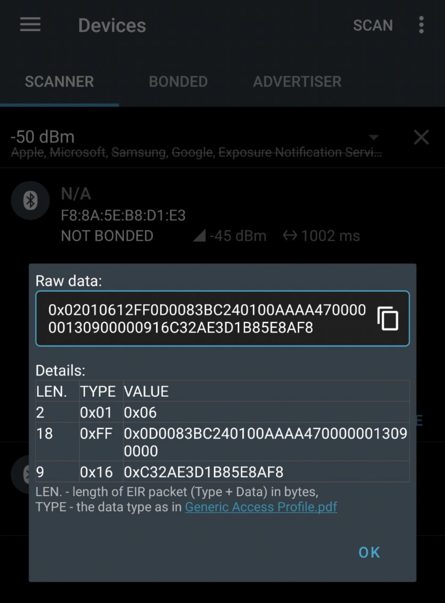

## Revision History

| DATE | REVISION | CHANGE |
| ---- | -------- | ------ |
| Mar 23, 2023| 1 | Initial release |
| May 16, 2023| 2 | With iGS03 built-in decoder |
