# Thingsboard Integration with iGS03 & Ingics Beacons

## Introduction

This document provide a step-by-step instruction to integrate a iGS03 BLE gateway and Ingics BLE sensor beacons with Thingsboard.

## What is Thingsboard

ThingsBoard is an open-source IoT platform that enables rapid development, management, and scaling of IoT projects. Our goal is to provide the out-of-the-box IoT cloud or on-premises solution that will enable server-side infrastructure for your IoT applications.

[[Official Documentation of Thingsboard]](https://thingsboard.io/docs/)]

## Installation

Please follow the [[Thingsboard Installation Guid](https://thingsboard.io/docs/user-guide/install/installation-options/)] to install Thingsboard system in your environment. In this guide, we use [[Docker+Ubuntu]](https://thingsboard.io/docs/user-guide/install/docker/).

## Basic Configurations for Ingics

### Import Rule Chains

First, we need to install some rule chains for handling the iGS03 publish message. The files located in [[rules]](./rules/) folder, you can find import function at the left-top corner of "Rule chains" page.

Here are the descriptions of these rules chains.

#### Ingics iGS03 Timestamp Correction

The iGS03 can publish the timestamp of BLE ADV receiving time. This rule chain used to correct the timestamp of Thingsboard message by the publish data.

[ingics_igs03_timestamp_correction.json](./rules/ingics_igs03_timestamp_correction.json)

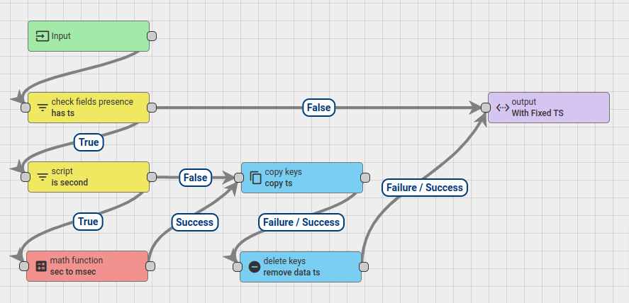

#### Ingics iGS03 Message Rule

This is the root rule chains for iGS03 publish message.

[ingics_igs03_message_rule.json](./rules/ingics_igs03_message_rule.json)

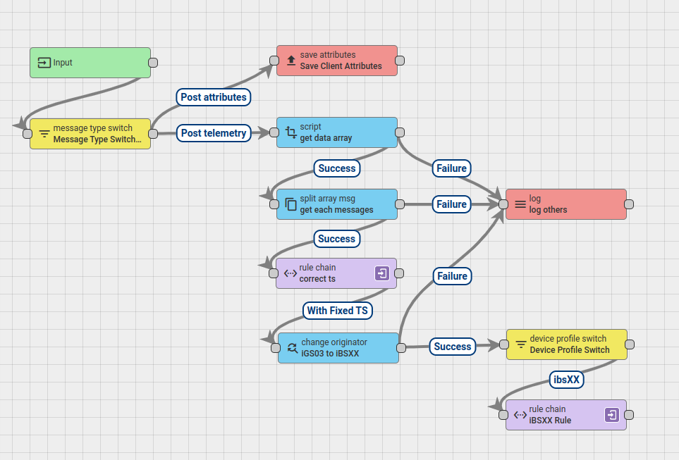

This iGS03 publish message (decoded format) looks like

    {"data":[
        {
            "ts":1678861738,
            "gw":"F008D1798BA4",
            "tag":"FB45C77FD45B",
            "rssi":-60,
            "type":"iBS01T",
            "vbatt":2.80,
            "btn":true,
            "temp":24.34,
            "rh":55
        },
        {
            "ts":1678871738,
            "gw":"F008D1798BA4",
            "tag":"607771FCD6DB",
            "rssi":-58,
            "type":"iBS03H",
            "vbatt":2.78,
            "hall":false,
        }
    ]}

This rule chain will do
- get the "data" array
- split the data array into different messages
- change the originator to Beacon device by "tag" field

In above example, there will be two messages pass to [Ingics Beacon Message Rule](#ingics-beacon-message-rule) on different beacon device entities (FB45C77FD45B & 607771FCD6DB, we will create them later).

#### Ingics Beacon Message Rule

This rule chains simply remove the useless keys in the message and save telemetry to the device entity.

### Import Device Profiles

Then, you need to import the device profiles for the iGS03 and Ingics Beacons. The files located in [[profiles]](./profiles/) folder. You can import them in "Device profiles".

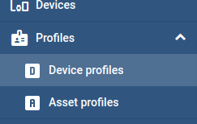

#### IGS03 Device Profile

This device profile use to define rule chain of iGS03 as [Ingics IGS03 Message Rule](#ingics-igs03-message-rule).

[igs03.json](./profiles/igs03.json)

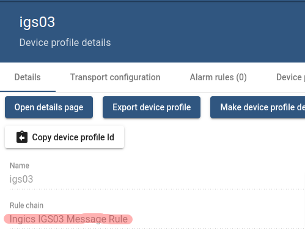

#### Ingics Beacon Device Profile

This device profile use to define rule chan of Ingics Beacon as [Ingics Beacon Message Rule](#ingics-beacon-message-rule).

[ibsxx.json](./profiles/ibsxx.json)

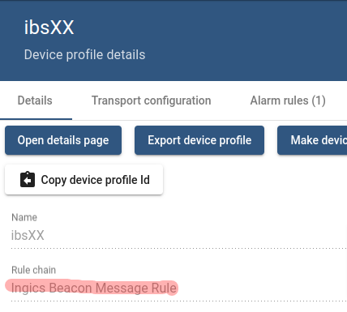

And also set up a common alarm rule (low battery) for Ingics Beacons.

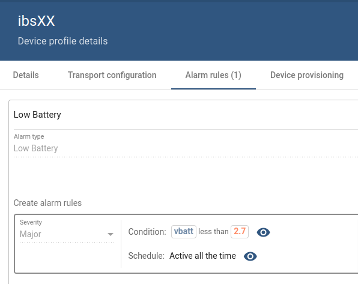

## Setup Gateway and Beacons

We finish the basic configuration for Thingsboard to integrate Ingics IGS03 and beacons in [previous section](#basic-configurations-for-ingics). Now we can start create the device entities for our gateway and beacons.

In this guide, we use belows devices.

| Model | MAC | Note |
| ----- | --- | ---- |
| iGS03W | F008D178943C | gateway for publish message |
| iBS01T | FB45C77FD45B | provide temperature & humidity |
| iBS03H | C67523368932 | provide hall sensor for door close state |

### Create Beacon Device Entity

Let's create the device entity for the iBS01T beacon. Only two configurations we need to take care.

First, the device name must be the BLE MAC of the beacon. We need the device name to deliver the message to this device entity in [Ingics IGS03 Message Rule Chain](#ingics-igs03-message-rule). The device name must match the 'tag' field in iGS03 message payload.

Second, setup the device profile to [ibsXX](#ingics-beacon-device-profile) for clean up the message and save telemetry.

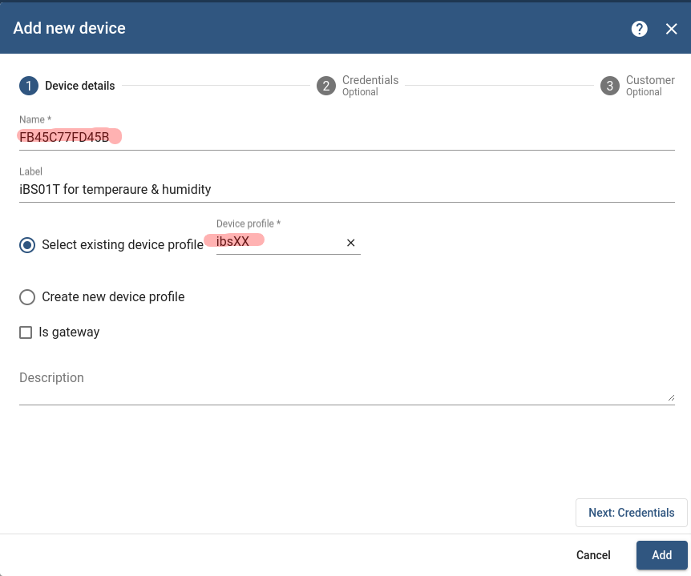

We don't care about the credentials for beacon device, just click "Add" to create the device entity. And them, create another device for iBS03H in the same way.

### Create Gateway Device Entity

Then, let's create the device entity for iGS03W. We setup the device profile to [igs03](#igs03-device-profile). That means we setup the root rule chain of this device to [Ingics IGS03 Message Rule Chain](#ingics-igs03-message-rule), all messages published to this device will handle by it.

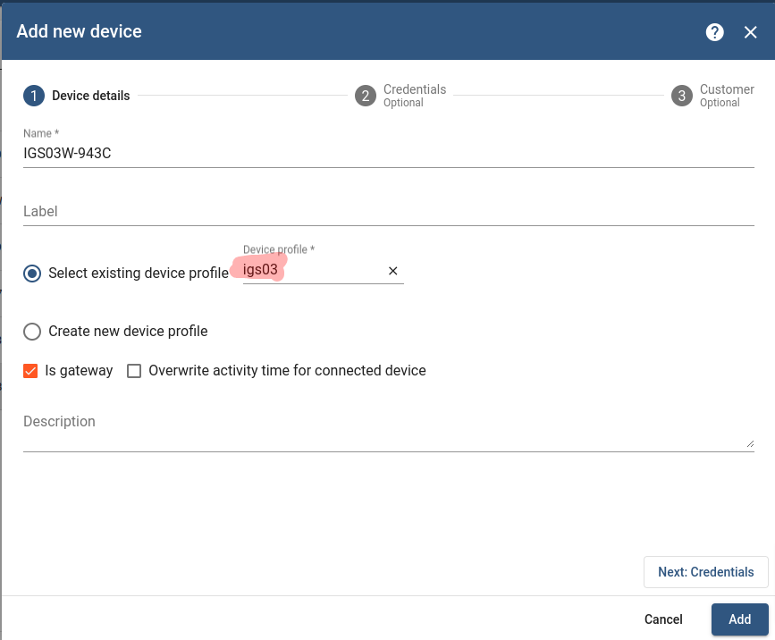

Then, we need to setup the credentials for MQTT authentication. Whatever "Access Token", "X.509" or "MQTT Basic" can be used by iGS03W. In this guide, we use "Access Token" for simply the setting.

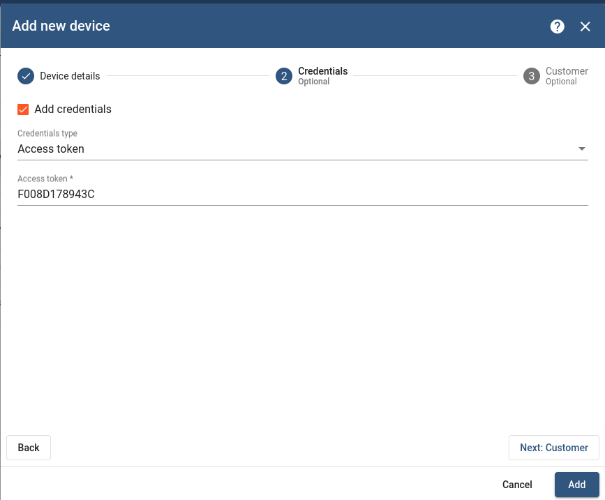

### Configure the iGS03 Application

Now we can setup the iGS03W to publish data to the MQTT broker of Thingsboard. Setup the "Application" as blow picture.

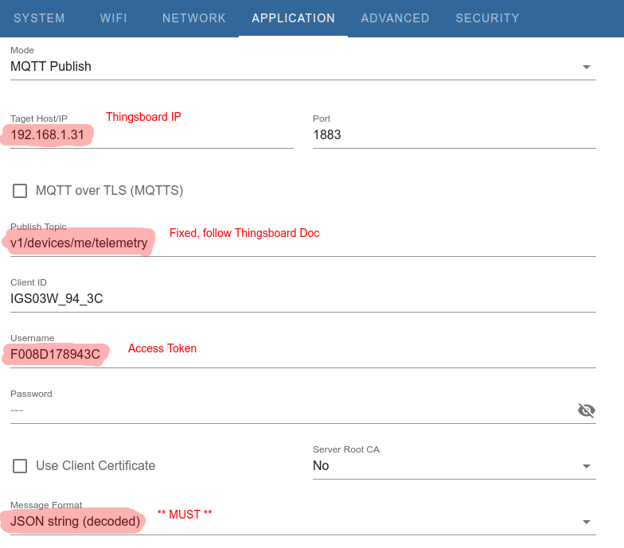

For the format option "JSON string (decoded)", it ask iGS03 to parse and publish the Ingics Beacon's ADV payload. If your iGS03 device has no this option, please try to upgrade the latest firmware.

When using different credential when create iGS03 device entity in Thingsboard, the configuration in iGS03 need to change to follow the security setting.

For avoid publish unwanted messages to the Thingsboard system, suggest to setup the filter on iGS03.

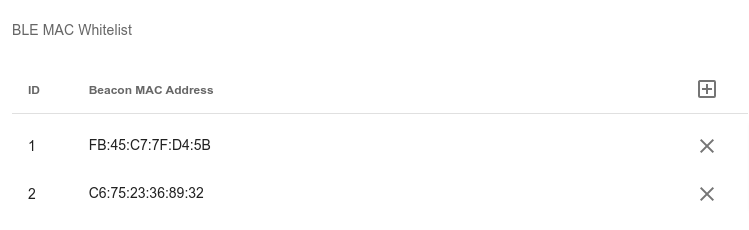

## Enjoy It

Things should be done. The telemetries should be published to the device entities now. Check the detail of the device entity.

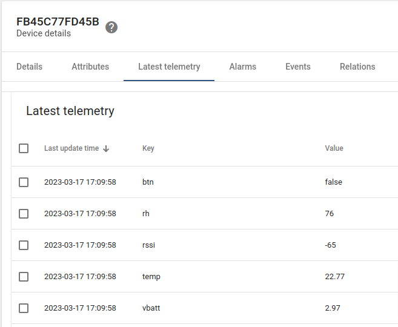

Now we can follow the documentation of Thingsboard to create dashboards, alarms, ....

## Troubleshoot

You can use MQTT client to check the Thingsboard configuration after gateway & beacon device entities created. Reference MQTT client usage in [Thingsboard Getting Startd](https://thingsboard.io/docs/getting-started-guides/helloworld/?connectdevice=mqtt-linux#step-2-connect-device). We use mosquitto in this guide.

For example:

    # mosquitto_pub -h <Thingsboard IP> -p <Thingsboard MQTT Port> -d -q 1 -t "v1/devices/me/telemetry" -u "<Access Token>" -m '{"data":[{"gw":"<iGS03 Mac>","tag":"<Beacon Mac>","rssi":-63,"type":"iBS01T","vbatt":2.8,"btn":false,"temp":21.88,"rh":79}]}'

If everything works fine, the device telemetry should be updated. If not, you can enable "Debug mode" in rule node, and check the debug events of the node to see if the input & output message as expected.
