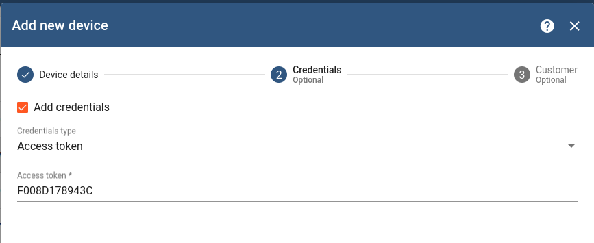

# ThingsBoard Integration

This repository provides an integration between [Ingics BLE Beacon Gateway](https://www.ingics.com/ble_wifi_gw.html) (iGS03) and [ThingsBoard](https://thingsboard.io/docs/), an open-source IoT platform for data collection, processing, and visualization.

## Table of Contents
- [ThingsBoard Integration](#thingsboard-integration)
  - [Table of Contents](#table-of-contents)
  - [Overview](#overview)
  - [Requirements](#requirements)
  - [Quick Start](#quick-start)
    - [Installation](#installation)
    - [Import Rule Chains](#import-rule-chains)
      - [Rules for Payload Parsing](#rules-for-payload-parsing)
      - [Rule Chains as Sub-Function](#rule-chains-as-sub-function)
      - [Rule Chain for iGS03 Message Handler](#rule-chain-for-igs03-message-handler)
    - [Import Device Profile](#import-device-profile)
      - [Device Profile for Gateway (iGS03)](#device-profile-for-gateway-igs03)
      - [Device Profile for Beacons](#device-profile-for-beacons)
    - [Create Device Entities](#create-device-entities)
      - [Create iGS03 Device Entity](#create-igs03-device-entity)
      - [Create Sensor Beacon Entity](#create-sensor-beacon-entity)
    - [Configure iGS03 Application](#configure-igs03-application)
    - [Enjoy It](#enjoy-it)
  - [Add New Parser for Other Sensor Tag](#add-new-parser-for-other-sensor-tag)
    - [Create Rule Chain for New Parser](#create-rule-chain-for-new-parser)
      - [Node Payload Parser](#node-payload-parser)
      - [Node Validation](#node-validation)
    - [Create Device Profile](#create-device-profile)
    - [Link Parser Rule and Device Profile](#link-parser-rule-and-device-profile)
    - [Create Device Entity](#create-device-entity)
  - [Troubleshoot](#troubleshoot)
    - [Simulate iGS03 Publish Data](#simulate-igs03-publish-data)

## Overview

Ingics Beacon Gateway (iGS03) provides a scalable, reliable and secure gateway for IoT deployments that require receiving BLE advertisements from BLE sensor tags (beacons). This integration enables the gateway to communicate with the ThingsBoard platform, allowing for the visualization and management of the data collected from the beacons.

The integration is achieved through a set of ThingsBoard Rule Chains that parse the retrieved data from the gateway and forward it to the specified device entity. This guide use Ingics iBS03T and iBS01H as example, and users can add/customize the parser rule chain for their BLE tags.

## Requirements

- ThingsBoard (3.4.4 tested in this guide)
- Ingics Beacon Gateway iGS03 x 1
- BLE sensor beacons using BLE advertisement to broadcast sensor data (Ingics [iBS03T](https://www.ingics.com/prod-ibs03t.html) and iBS01H in this guide)

## Quick Start

### Installation

Please follow the [ThingsBoard Installation Guid](https://thingsboard.io/docs/user-guide/install/installation-options/) to setup a ThingsBoard system. In this guide, we use [Docker+Ubuntu](https://thingsboard.io/docs/user-guide/install/docker/) and [thingsboard/tb-postgres](https://hub.docker.com/r/thingsboard/tb-postgres) as docker image with In-Memory queue service.

### Import Rule Chains

First, we need to install some rule chains for handling the iGS03 publish message. The files located in [rules](./rules/) folder.

#### Rules for Payload Parsing

Below rules are used for paring BLE ADV data for different beacons.

| FILE | DESCRIPTION |
| ---- | ----------- |
| [ingics_ibs01h_parser_rule.json](./rules/ingics_ibs01h_parser_rule.json) | Ingics iBS01H Payload Parser Rule |
| [ingics_ibs01t_parser_rule.json](./rules/ingics_ibs01t_parser_rule.json) | Ingics iBS01H Payload Parser Rule |
| [ingics_ibs03t_parser_rule.json](./rules/ingics_ibs03t_parser_rule.json) | Ingics iBS03T Payload Parser Rule |

#### Rule Chains as Sub-Function

[ingics_igs03_timestamp_correction.json](./rules/ingics_igs03_timestamp_correction.json)

Rule chain for filling the BLE ADV timestamp into ThingsBoard message. It will be called by root rule chain of iGS03 message handler.

#### Rule Chain for iGS03 Message Handler

[ingics_igs03_message_rule.json](./rules/ingics_igs03_message_rule.json)

This is the root rule chain for iGS03 device. All messages publish to the device will be handled by this rule chain. The rule chain did
1. Split messages (iGS03 message may contain multiple data in one publish)
2. Pre-parsing for message's tag mac address, rssi, timestamp and BLE advertisement payload
3. Change the originator to the beacon device by tag address
4. Select payload parser rule by device profile name
5. Clean up the message of parser output, and save telemetry for the device

### Import Device Profile

Then, import the device profiles. The device profiles are used to connect the device entities (we will create them in [next section](#create-device-entities)) and rule chains. The files located in [profiles](./profiles/) folder.

#### Device Profile for Gateway (iGS03)

This profile ([igs03.json](./profiles/igs03.json)) is used to define the root rule chain for iGS03 device.

#### Device Profile for Beacons

The profiles for beacon device is used for iGS03 root rule chain to select correct payload parser only.

File List:

| FILE | DESCRIPTION |
| ---- | ----------- |
| [ibs01h.json](./profiles/ibs01h.json) | Profile for iBS01H, used to link to iBS01H parser rule |
| [ibs01t.json](./profiles/ibs01t.json) | Profile for iBS01T, used to link to iBS01T parser rule |
| [ibs03t.json](./profiles/ibs03t.json) | Profile for iBS03T, used to link to iBS03T parser rule |

### Create Device Entities

We use below devices in this guide.
| Model | MAC | Note |
| ----- | --- | ---- |
| iGS03W | F008D178943C | gateway for publish message |
| iBS03T | 806FB087F49B | provide temperature & humidity |
| iBS01H | F973D9D36662 | provide hall sensor for door close state |

#### Create iGS03 Device Entity

Let's create a new device entity for iGS03.

The main configuration is setup the device profile to [igs03](#device-profile-for-gateway-igs03). That also means we setup the root rule chain of this device to [IGS03 Message Handler](#rule-chain-for-igs03-message-handler), all messages published to this device will handle by it.

Then, we need to setup the credentials for MQTT authentication. Whatever "Access Token", "X.509" or "MQTT Basic" can be used by iGS03. In this guide, we use "Access Token" here for simplify the setting. We will use the token to setup iGS03 application [later](#configure-igs03-application).

#### Create Sensor Beacon Entity

Let's create the device entity for the iBS03T beacon. There are two configurations we need to take care.

First, the device name must be the BLE MAC of the beacon. We need the device name to deliver the message to this device entity in [Ingics IGS03 Message Rule Chain](#rule-chain-for-igs03-message-handler). The device name must match the 'tag' field in iGS03 message payload.

Second, setup the device profile to the match the model name. The message handler will use the configured profile name to [select payload parser](#device-profile-for-beacons).

We don't care about the credentials for beacon device, just click "Add" to create the device entity. And them, create another device for iBS01H in the same way.

### Configure iGS03 Application

Now we can setup the iGS03 to publish data to the MQTT broker of ThingsBoard. Connect to the iGS03 WebUI and setup the "Application" as blow.

1. Target Host/IP

   The IP address of ThingsBoard

2. Publish Topic

   > v1/device/me/telemetry

   Defined by [ThingsBoard MQTT API]([https://](https://thingsboard.io/docs/reference/mqtt-api/#telemetry-upload-api)).

3. Username

   Must be the access token we setup when [create iGS03 device entity](#create-gateway-device-entity) in ThingsBoard. If you choice different credential when create iGS03 device entity, follow your security settings to configure the iGS03 application.

4. Message Format

    > JSON String (raw)

   ThingsBoard only allow JSON format data for publish.

The application settings should be looks like

For avoid publish unwanted messages to the ThingsBoard system, suggest to setup the filter on iGS03, too.

### Enjoy It

Things should be done. The telemetries should be published to the device entities now. Check the detail of the device entity.

Now you can follow the documentation of ThingsBoard to create dashboards, alarms, ....

## Add New Parser for Other Sensor Tag

You may use different sensor tags not include in this guide. This chapter provide steps for you to add new payload parser for your own sensor beacon. For demo, we assume the beacon model name is "MyNewTag".

### Create Rule Chain for New Parser

You can use our parser rule chain as template (import then modify the parser script and rule name). Let's call it "MyNewTag Parser".

#### Node Payload Parser

First, you need to modify the script in "payload parser" node. The ThingsBoard support use javascript to development the parser logic. Here is an example of IN/OUT message of this parser node.

IN

    {
      "type": "GPRP",
      "tag": "806FB087F49B",
      "gw": "F008D178943C",
      "rssi": -79,
      "payload": "02010612FF0D0083BC240100280A5300000014040000"
    }

OUT

    {
      "type": "GPRP",
      "tag": "806FB087F49B",
      "gw": "F008D178943C",
      "rssi": -79,
      "payload": "02010612FF0D0083BC240100280A5300000014040000",
      "vbatt": 2.92,
      "temp": 26,
      "rh": 83,
      "btn": false
    }

The payload field in IN message will be the HEX string of the beacon's BLE advertisement data. And the fields "vbatt", "temp", "rh" and "btn" are parsed from the payload string and will be saved as the telemetries of the device. You should refer your beacon's documentation to development the parser script for it.

#### Node Validation

Then, you need to modify the validation node to validate the OUT message of parser node. In this example, we validate the OUT message should include "vbatt", "temp", "rh" and "btn". You should change it to meet the MyNewTag's telemetry list.

### Create Device Profile

The iGS03 root rule chains use device profile to select parser, so we need to create a new device profile for the new parser. The only configuration we care about is the profile name, suggest use the model name as the profile name.

### Link Parser Rule and Device Profile

Now we need to link the parser and profile.
1. Open the Ingics iGS03 Message Rule Chain.
2. Add a new "rule chain" node as below

   

3. Link node "Device Profile Switch" to "MyNewTag" with label "MyNewTag"
4. Link "MyNewTag" to node "delete keys" by label "telemetry"

Finally, it should looks as below.

### Create Device Entity

Now, we can add the device entity for the beacon. Follow the same way we did for iBS03T, create the device use BLE mac address as device name, and choice the "MyNewTag" as device profile.

## Troubleshoot

### Simulate iGS03 Publish Data

You may want to simulate the iGS03 to publish data to ThingsBoard for debugging the configuration or parser rule. The iGS03 publish format for "JSON string (raw)" option should be

    {"data":["$GPRP,<TAG MAC>,<GW MAC>,<RSSI>,<BLE ADV DATA>"]}

The "data" field is an string array, it may contain multiple messages. Then you can simulate the iGS03 publish by any MQTT client.

For example:

    # mosquitto_pub -h <ThingsBoard IP> -p 1883 -t v1/devices/me/telemetry  -u <Access Token> -d -m '{"data":["$GPRP,C67523368932,F008D178943C,-69,02010612FF2C0883BC360101AAAA7502000034030000"]}'

About the "BLE ADV DATA", you can try to find it one your beacon's document. Or, you can try to capture the real packet from your beacon by some BLE applications or tools. For example, using "NRF Connect" on mobile phone. Remove the prefix "0x" of "Raw data", that's the data string we need.

